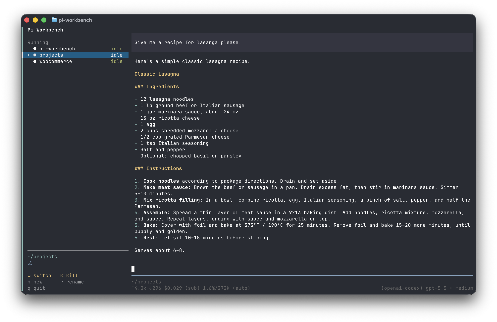

# pi-workbench



### Terminal workbench for live Pi sessions

**[Install](#install)** · **[Usage](#usage)** · **[Controls](#controls)** · **[Configuration](#configuration)** · **[Development](#development)**

_Run multiple [Pi](https://pi.dev) sessions side by side, keep them alive, and switch between them without leaving your terminal._

`pi-workbench` gives Pi a compact tmux-based workspace: a session sidebar on the left, your active Pi pane on the right, and hidden live panes for the sessions you're not currently viewing. Start it once, jump between projects, reopen stopped sessions, and keep each Pi process and terminal state intact.

---

## Install

```bash
pi install npm:pi-workbench
pi-workbench
```

Global Pi npm installs use `npm install -g`, so the `pi-workbench` binary should be available on `PATH` after installation.

Project-local installs may not expose the CLI globally. If `pi-workbench` is not on `PATH`, the extension shows a warning with suggested fixes.

---

## Usage

```bash
pi-workbench
```

When launched from a project directory, pi-workbench opens a two-pane terminal layout:

| Pane | Purpose |
| --- | --- |
| Left | Compact session list, 36 columns by default |
| Right | Active Pi session |

If a Pi session for the current directory is already running, pi-workbench reuses it instead of spawning a duplicate. Inactive Pi sessions stay alive in hidden tmux windows and are swapped into the right pane when selected. If a managed Pi session exits, it remains in the list as stopped and can be reopened from the sidebar.

### Starting sessions in another directory

Press `n` to open the new-session picker. Choose a recent project with `↑`/`↓` and `Enter`, or type a directory path directly. While typing, pi-workbench shows a muted inline completion suggestion; press `Tab` to accept it. `~` paths and relative paths are supported.

---

## Controls

| Key | Action |
| --- | --- |
| `ctrl+g` | Focus the sidebar from the workbench |
| `↑` / `↓` | Move selection |
| `Enter` | Switch selected session into the right pane; reopen it if stopped |
| `n` | Start a new Pi session from recent projects or a typed path |
| `r` | Rename selected session in the workbench |
| `k` | Kill selected live session |
| `x` | Remove selected stopped session |
| `q` | Quit workbench |

Quitting asks for confirmation and then kills managed Pi processes. Pi session histories remain available through Pi's normal resume flow.

Killing a selected live session also asks for confirmation. If you kill the active session and no other live session exists, pi-workbench restarts that same workbench row in place so the right pane remains usable without creating duplicate rows.

---

## Configuration

### Sidebar layout

The sidebar defaults to 36 columns. Override it for one run:

```bash
PI_WORKBENCH_SIDEBAR_WIDTH=40 pi-workbench
```

Or persist preferences in `~/.pi/workbench/config.json`:

```json
{
  "sidebarWidth": 40,
  "hideTmuxStatus": true,
  "mouse": true
}
```

### Ghostty and tmux keys

Pi works inside tmux, but tmux needs extended key forwarding for modified keys. Recommended `~/.tmux.conf`:

```tmux
set -g extended-keys on
set -g extended-keys-format csi-u
```

Then restart tmux fully:

```bash
tmux kill-server
tmux
```

pi-workbench also tries to enable extended-key handling for the current tmux server, but adding the config above keeps the setting persistent.

### Mouse mode

pi-workbench enables tmux mouse mode for its managed session so you can click the sidebar or right pane to change focus where supported.

If mouse-wheel scrolling enters tmux copy-mode and typing starts searching instead of returning to Pi's prompt, disable mouse mode in `~/.pi/workbench/config.json`:

```json
{
  "mouse": false
}
```

Apply it to a running workbench immediately with:

```bash
tmux set-option -t pi-workbench mouse off
```

With mouse mode off, use `ctrl+g` to focus the sidebar from the right pane.

---

## How it works

- The Pi extension registers each Pi process in `~/.pi/workbench/sessions.json`.
- The extension updates coarse status: `ready` when a response is complete, `running` from prompt submission until the response finishes, and `stopped` when a session exits.
- The CLI creates a tmux session named `pi-workbench`.
- The visible `workbench` window contains the compact sidebar and active Pi pane.
- Other managed Pi sessions live in hidden tmux windows.
- Switching uses `tmux swap-pane` to preserve each Pi process and PTY state.
- The sidebar groups active and stopped sessions, disambiguates duplicate names, supports local renames, and shows the selected session path and git branch in the footer.

---

## CLI commands

```bash
pi-workbench doctor          # print environment diagnostics
pi-workbench doctor --json   # machine-readable diagnostics
pi-workbench reset           # kill the workbench tmux session
pi-workbench reset --clear-registry
pi-workbench prune           # remove stale live entries
pi-workbench prune --stopped # remove stopped entries too
pi-workbench smoke           # run automated tmux smoke test
```

Equivalent npm scripts are available during development:

```bash
npm run doctor
npm run reset
npm run prune
npm run smoke
```

---

## Development

```bash
git clone https://github.com/dmallory42/pi-workbench.git
cd pi-workbench
npm install
npm run check
npm link
pi install /path/to/pi-workbench
pi-workbench
```

`npm run check` runs TypeScript, unit tests, and an automated tmux smoke test.

The smoke test creates temporary isolated tmux sessions, verifies the two-pane layout, checks the compact sidebar width, exercises the real sidebar render path, verifies focus hints and selected-row highlighting, checks confirmation flows, verifies active-session restart behavior, verifies a `swap-pane` session switch, and then tears the tmux sessions down.
